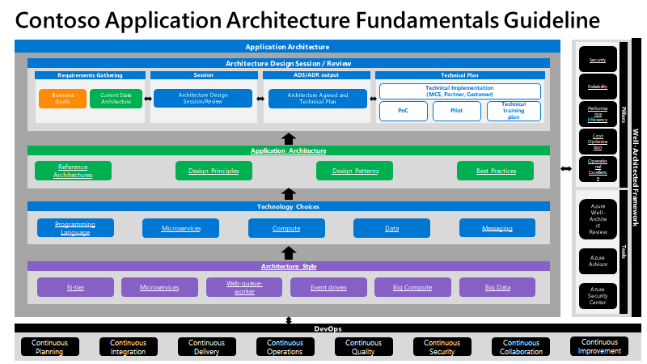

# Contoso application architecture fundamentals

This library of content presents a structured approach for designing applications on Azure that are scalable, secure, resilient, and highly available. The guidance is based on proven practices that we have learned from customer engagements.

## Introduction

The cloud is changing how applications are designed and secured. Instead of monoliths, applications are decomposed into smaller, decentralized services. These services communicate through APIs or by using asynchronous messaging or eventing. Applications scale horizontally, adding new instances as demand requires.

These trends bring new challenges. Application states are distributed. Operations are done in parallel and asynchronously. Applications must be resilient when failures occur. Malicious actors continuously target applications. Deployments must be automated and predictable. Monitoring and telemetry are critical for gaining insight into the system. This guide is designed to help you navigate these changes.

| Traditional on-premises              	| Modern cloud                                       	|
|--------------------------------------	|----------------------------------------------------	|
| Monolithic                           	| Decomposed                                         	|
| Designed for predictable scalability 	| Designed for elastic scale                         	|
| Relational database                  	| Polyglot persistence (mix of storage technologies) 	|
| Relational database                  	| Asynchronous processing                            	|
| Design to avoid failures (MTBF)      	| Design for failure (MTTR)                          	|
| Occasional large updates             	| Frequent small updates                             	|
| Manual management                    	| Automated self-management                          	|
| Snowflake servers                    	| Immutable infrastructure                           	|

## How this guidance is structured

The Azure application architecture fundamentals guidance is organized as a series of steps, from the architecture and design to implementation. For each step, there is supporting guidance that will help you with the design of your application architecture.

## Architecture styles

The first decision point is the most fundamental. What kind of architecture are you building? It might be a microservices architecture, a more traditional N-tier application, or a big data solution. We have identified several distinct architecture styles. There are benefits and challenges to each.

Learn more: [Architecture styles](./architecture-styles/)

## Technology choices

Knowing the type of architecture you are building, now you can start to choose the main technology pieces for the architecture. The following technology choices are critical:

- *Compute* refers to the hosting model for the computing resources that your applications run on. For more information, see [Choose a compute service](./technology-choices/compute-decision-tree/).

- *Data stores* include databases but also storage for message queues, caches, logs, and anything else that an application might persist to storage. For more information, see [Choose a data store](./technology-choices/data-store-overview/).

- *Messaging* technologies enable asynchronous messages between components of the system. For more information, see [Choose a messaging service](./technology-choices/messaging/).

You will probably have to make additional technology choices along the way, but these three elements (compute, data, and messaging) are central to most cloud applications and will determine many aspects of your design.

## Design the architecture

Once you have chosen the architecture style and the major technology components, you are ready to tackle the specific design of your application. Every application is different, but the following resources can help you along the way:

### Reference architectures

Depending on your scenario, one of our [reference architectures](../reference-architectures/architectures/?filter=reference-architecture) may be a good starting point. Each reference architecture includes recommended practices, along with considerations for scalability, availability, security, resilience, and other aspects of the design. Most also include a deployable solution or reference implementation.

### Design principles

We have identified 10 high-level design principles that will make your application more scalable, resilient, and manageable. These design principles apply to any architecture style. Throughout the design process, keep these 10 high-level design principles in mind. For more information, see [Design principles](./design-principles/).

### Design patterns

Software design patterns are repeatable patterns that are proven to solve specific problems. Our catalog of Cloud design patterns addresses specific challenges in distributed systems. They address aspects such as availability, high availability, operational excellence, resiliency, performance, and security. You can find our catalog of design patterns [here](../patterns/).

### Best practices

Our [best practices](../best-practices/) articles cover various design considerations including API design, autoscaling, data partitioning, caching, and so forth. Review these and apply the best practices that are appropriate for your application.

## Next steps

> [Architecture styles](./architecture-styles/)
