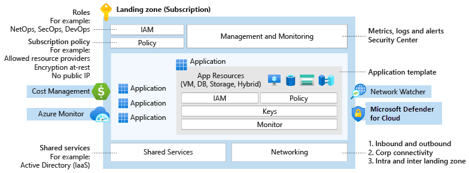

# What is an Building Block?

A Building Block is an environment for hosting your workloads, preprovisioned through code. Watch the following video to learn more.

Building Blocks are the output of a multisubscription Azure environment that accounts for scale, security governance, networking, and identity. Building Blocks **enable application migration, modernization, and innovation at enterprise-scale in Azure**. These building blocks consider all platform resources that are required to support the customer's application portfolio and don't differentiate between infrastructure as a service or platform as a service.

## Scalable and modular

No single solution fits all technical environments. A few Building Block implementation options can help you meet the deployment and operations needs of your growing cloud portfolio.

- **Scalable:** All Building Blocks support cloud adoption at scale by providing repeatable environments, with consistent configuration and controls, regardless of the workloads or Azure resources deployed to each Building Block instance.
- **Modular:** All Building Blocks provide a modular approach to building out your environment, based on a common set of design areas. Each design area can be easily extended to support the distinct needs of various technology platforms like Azure SQL Database, Azure Kubernetes Service, and Azure Virtual Desktop.

Whether you're looking to deploy your first production application to Azure or you're operating a complex portfolio of tech platforms and workloads, the Building Block implementation options can be tailored to your needs.

## Building Block conceptual architecture

For many organizations, the Building Block conceptual architecture below represents the destination in their cloud adoption journey. It's a mature, scaled-out target architecture intended to help organizations operate successful cloud environments that drive their business while maintaining best practices for security and governance.

This conceptual architecture represents scale and maturity decisions based on a wealth of lessons learned and feedback from customers who have adopted Azure as part of their digital estate.

While your specific implementation might vary, as a result of specific business decisions or existing investments in tools that need to persist in your cloud environment, this conceptual architecture will help set a direction for the overall approach your organization takes to designing and implementing a Building Block.

Use this architecture as a starting point. Download the [Visio file](../assets/files/enterprise-scale-architecture.vsdx) and modify it to fit your specific business and technical requirements when planning your Building Block implementation.

## Building Block accelerators

The accelerator is an Azure-portal-based deployment that will provide a full implementation of the conceptual architecture, along with opinionated configurations for key components such as management groups and policies.

Find below the main Contoso Building Blocks Accelerators

## Implementation options

The following table describes some of the implementation options for landing zones and the variables that might drive your decision.

# Implement Contoso Building Blocks

Does your business require an initial implementation of landing zones? And do these landing zones need fully integrated governance, security, and an operations control plane from the start? With the following examples, you can use the Azure portal or infrastructure as code to set up and configure your Azure environment. It's also possible to transition between the portal and infrastructure as code (recommended) when your organization is ready.

## Reference implementation

The following table lists example reference implementations based on the recommended enterprise-scale architecture.

| Example deployment                                                                                                              	| Description                                                                                                                                                                                                                                                                                                                       	| GitHub repo                         	| Deploy to Azure                      	|
|---------------------------------------------------------------------------------------------------------------------------------	|-----------------------------------------------------------------------------------------------------------------------------------------------------------------------------------------------------------------------------------------------------------------------------------------------------------------------------------	|-------------------------------------	|--------------------------------------	|
| [Contoso AKS Landing Zone Accelerator](https://github.com/evilazaro/AKS-Construction/)                                          	| Contoso AKS Landing Zone Accelerator represents the strategic design path and target technical state for an Azure Kubernetes Service (AKS) deployment. This solution provides an architectural approach and reference implementation to prepare landing zone subscriptions for a scalable Azure Kubernetes Service (AKS) cluster. 	| [Example in GitHub][GitHub-AKS]     	| [![DTA-Button-AKS]][DTA-AKS]         	|
| [Contoso Enterprise-scale foundation](https://github.com/evilazaro/Enterprise-Scale/blob/main/docs/reference/wingtip/README.md) 	| The suggested foundation for enterprise-scale adoption.                                                                                                                                                                                                                                                                           	| [Example in GitHub][GitHub-WingTip] 	| [![Dta-button-wingtip]][dta-wingtip] 	|

Each reference implementation deploys platform resources to the selected target environment. Deployment details and an overview of the deployed resources can be found using the GitHub link in the table above.

<!-- The following section is used to store references to external images and links to reduce maintenance overhead and enable tooltips -->

[/]: # (*******************************)
[/]: # (External image references below)
[/]: # (*******************************)

[DTA-Button-WingTip]: https://raw.githubusercontent.com/Azure/azure-quickstart-templates/master/1-CONTRIBUTION-GUIDE/images/deploytoazure.svg?sanitize=true "Deploy WingTip reference implementation (foundation) to Azure."
[DTA-Button-AdventureWorks]: https://raw.githubusercontent.com/Azure/azure-quickstart-templates/master/1-CONTRIBUTION-GUIDE/images/deploytoazure.svg?sanitize=true "Deploy AdventureWorks reference implementation (hybrid connectivity with hub and spoke) to Azure."
[DTA-Button-Contoso]: https://raw.githubusercontent.com/Azure/azure-quickstart-templates/master/1-CONTRIBUTION-GUIDE/images/deploytoazure.svg?sanitize=true "Deploy Contoso reference implementation (hybrid connectivity with virtual wan) to Azure."
[DTA-Button-TreyResearch]: https://raw.githubusercontent.com/Azure/azure-quickstart-templates/master/1-CONTRIBUTION-GUIDE/images/deploytoazure.svg?sanitize=true "Deploy TreyResearch reference implementation for small organizations to Azure."
[DTA-Button-AzureGov]: https://raw.githubusercontent.com/Azure/azure-quickstart-templates/master/1-CONTRIBUTION-GUIDE/images/deploytoazure.svg?sanitize=true "Deploy Enterprise-scale reference implementation for Azure Government."
[DTA-Button-AKS]: https://raw.githubusercontent.com/Azure/azure-quickstart-templates/master/1-CONTRIBUTION-GUIDE/images/deploytoazure.svg?sanitize=true "Deploy AKS Landing Zone  reference implementation for Azure."

[/]: # (**************************)
[/]: # (External link labels below)
[/]: # (**************************)

[GitHub-WingTip]: https://github.com/evilazaro/Enterprise-Scale/blob/main/docs/reference/wingtip/README.md
[GitHub-AdventureWorks]: https://github.com/evilazaro/Enterprise-Scale/blob/main/docs/reference/adventureworks/README.md
[GitHub-Contoso]: https://github.com/evilazaro/Enterprise-Scale/blob/main/docs/reference/contoso/Readme.md
[GitHub-TreyResearch]: https://github.com/evilazaro/Enterprise-Scale/blob/main/docs/reference/treyresearch/README.md
[Github-AzureGov]: https://aka.ms/enterprisescale
[Github-AKS]: https://github.com/evilazaro/Aks-Construction

[DTA-WingTip]: https://portal.azure.com/#blade/Microsoft_Azure_CreateUIDef/CustomDeploymentBlade/uri/https%3A%2F%2Fraw.githubusercontent.com%2FAzure%2FEnterprise-Scale%2Fmain%2FeslzArm%2FeslzArm.json/uiFormDefinitionUri/https%3A%2F%2Fraw.githubusercontent.com%2FAzure%2FEnterprise-Scale%2Fmain%2FeslzArm%2Feslz-portal.json
[DTA-AdventureWorks]: https://portal.azure.com/#blade/Microsoft_Azure_CreateUIDef/CustomDeploymentBlade/uri/https%3A%2F%2Fraw.githubusercontent.com%2FAzure%2FEnterprise-Scale%2Fmain%2FeslzArm%2FeslzArm.json/uiFormDefinitionUri/https%3A%2F%2Fraw.githubusercontent.com%2FAzure%2FEnterprise-Scale%2Fmain%2FeslzArm%2Feslz-portal.json
[DTA-Contoso]: https://portal.azure.com/#blade/Microsoft_Azure_CreateUIDef/CustomDeploymentBlade/uri/https%3A%2F%2Fraw.githubusercontent.com%2FAzure%2FEnterprise-Scale%2Fmain%2FeslzArm%2FeslzArm.json/uiFormDefinitionUri/https%3A%2F%2Fraw.githubusercontent.com%2FAzure%2FEnterprise-Scale%2Fmain%2FeslzArm%2Feslz-portal.json
[DTA-TreyResearch]: https://portal.azure.com/#blade/Microsoft_Azure_CreateUIDef/CustomDeploymentBlade/uri/https%3A%2F%2Fraw.githubusercontent.com%2FAzure%2FEnterprise-Scale%2Fmain%2Fdocs%2Freference%2Ftreyresearch%2FarmTemplates%2Fes-lite.json/uiFormDefinitionUri/https%3A%2F%2Fraw.githubusercontent.com%2FAzure%2FEnterprise-Scale%2Fmain%2Fdocs%2Freference%2Ftreyresearch%2FarmTemplates%2Fes-portal.json
[DTA-AzureGov]: https://portal.azure.us/#blade/Microsoft_Azure_CreateUIDef/CustomDeploymentBlade/uri/https%3A%2F%2Fraw.githubusercontent.com%2FAzure%2FEnterprise-Scale%2Fmain%2FeslzArm%2FeslzArm.json/uiFormDefinitionUri/https%3A%2F%2Fraw.githubusercontent.com%2FAzure%2FEnterprise-Scale%2Fmain%2FeslzArm%2Feslz-portal.json
[DTA-AKS]: https://evilazaro.github.io/AKS-Construction/
