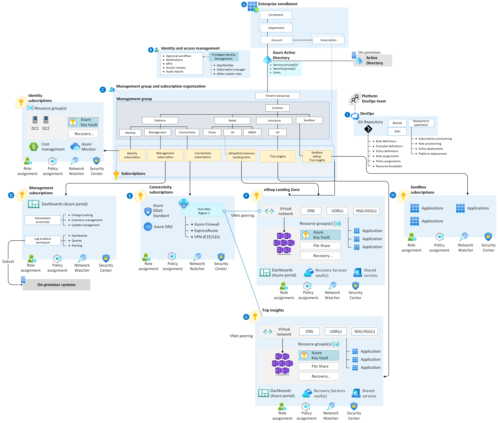

# What is an Building Block?

Building Blocks are the output of a multisubscription Azure environment that accounts for scale, security governance, networking, and identity. Building Blocks enable application migration, modernization, and innovation at enterprise-scale in Azure. These zones consider all platform resources that are required to support the customer's application portfolio and don't differentiate between infrastructure as a service or platform as a service.

A Building Block is an environment for hosting your workloads, preprovisioned through code. Watch the following video to learn more.

## Scalable and modular

No single solution fits all technical environments. A few Building Block implementation options can help you meet the deployment and operations needs of your growing cloud portfolio.

- **Scalable:** All Building Blocks support cloud adoption at scale by providing repeatable environments, with consistent configuration and controls, regardless of the workloads or Azure resources deployed to each Building Block instance.
- **Modular:** All Building Blocks provide a modular approach to building out your environment, based on a common set of design areas. Each design area can be easily extended to support the distinct needs of various technology platforms like Azure SQL Database, Azure Kubernetes Service, and Azure Virtual Desktop.

Whether you're looking to deploy your first production application to Azure or you're operating a complex portfolio of tech platforms and workloads, the Building Block implementation options can be tailored to your needs.

## Building Block conceptual architecture

For many organizations, the Building Block conceptual architecture below represents the destination in their cloud adoption journey. It's a mature, scaled-out target architecture intended to help organizations operate successful cloud environments that drive their business while maintaining best practices for security and governance.

This conceptual architecture represents scale and maturity decisions based on a wealth of lessons learned and feedback from customers who have adopted Azure as part of their digital estate.

While your specific implementation might vary, as a result of specific business decisions or existing investments in tools that need to persist in your cloud environment, this conceptual architecture will help set a direction for the overall approach your organization takes to designing and implementing a Building Block.

Use this architecture as a starting point. Download the [Visio file](../assets/files/enterprise-scale-architecture.vsdx) and modify it to fit your specific business and technical requirements when planning your Building Block implementation.

## Building Block accelerator

For organizations where this conceptual architecture fits with the operating model and resource structure they plan to use, there's a ready-made deployment experience called the **Building Block accelerator**.

The accelerator is an Azure-portal-based deployment that will provide a full implementation of the conceptual architecture, along with opinionated configurations for key components such as management groups and policies.

Deploying the Building Block accelerator requires permissions for creating resources at the tenant (`/`) scope. These permissions can be granted by following the guidance in [Tenant deployments with ARM templates: Required access](/azure/azure-resource-manager/templates/deploy-to-tenant?tabs=azure-powershell#required-access).

There are other deployment options available, some that deliver the full architecture using third-party deployment technologies, and others that start from a smaller footprint. For more information, see [Implementation options](./implementation-options.md).

## Next steps

Organizations may be at different stages of their cloud journey when reviewing this guidance. As a result, the actions and recommendations required to progress toward the outcome detailed above may vary. To understand best next actions in relation to where you are in your cloud adoption, review the journey to the target architecture content.

> [Journey to the target architecture](./landing-zone-journey.md)

When you're choosing the right Building Block implementation option, you should understand the [Building Block design areas](./design-areas.md).

> [Review design areas](./design-areas.md)

# Welcome to the Building Blocks

[AKS Landing Zone Accelerator](../_docs/building-blocks-docs/aks-accelerator-lz/aks-accelerator-lz-overview.md)
